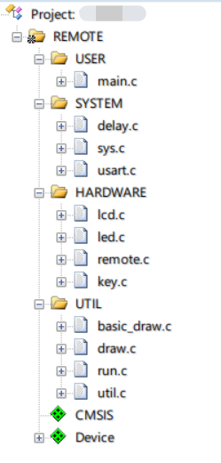
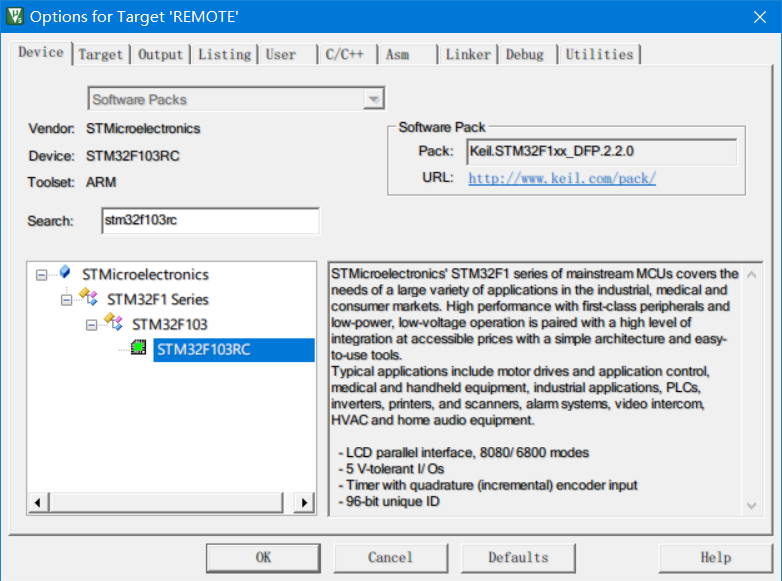
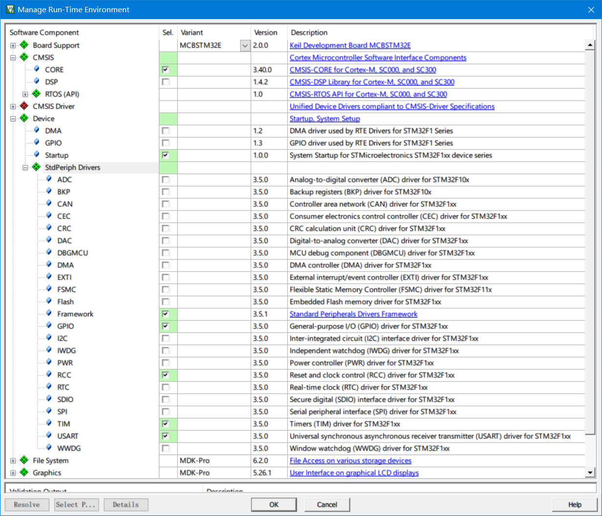
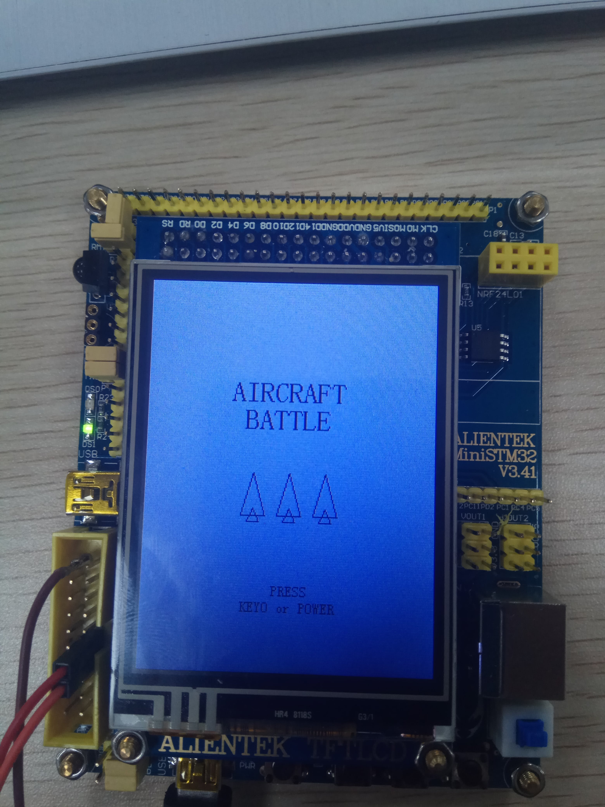
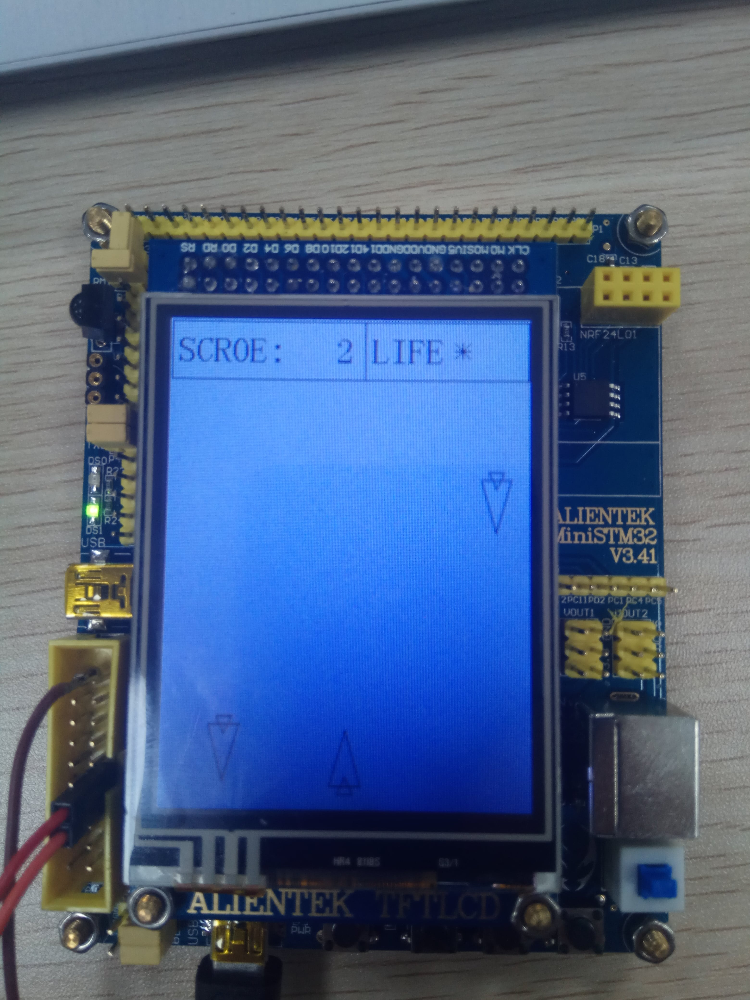
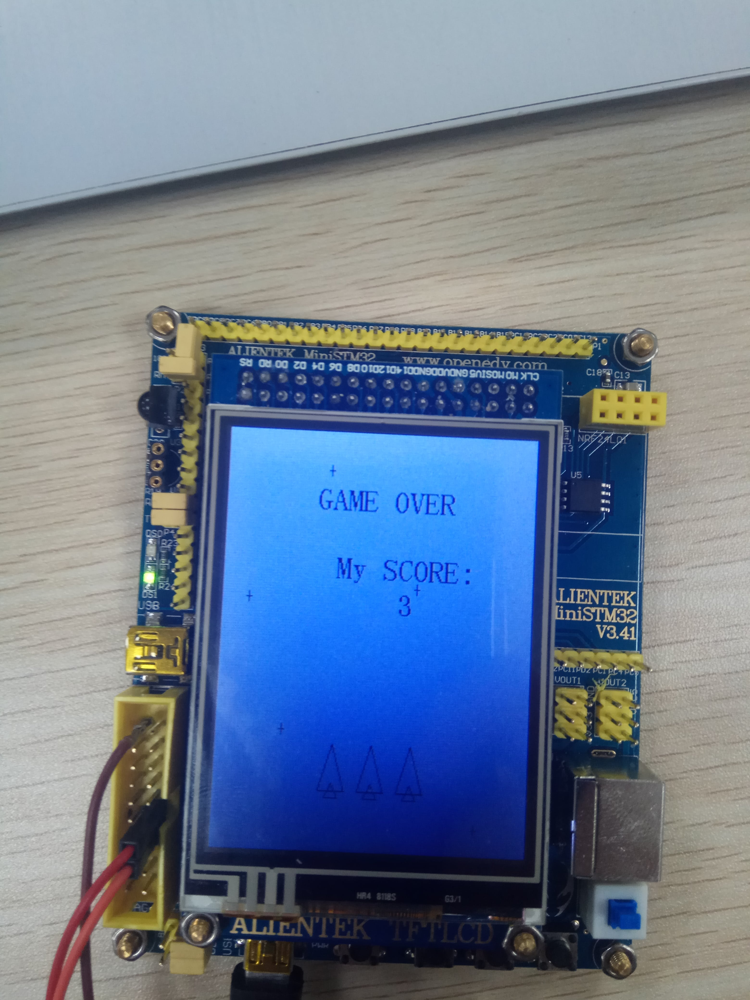

# STM32f103RC_aircraft_battle_demo
*aircraft_battle demo on ARM STM32f103RC, using opendev(开源电子网) lirbrary, lesson assignment of Embedded Development*

> dependencies
1. stdlib
    + CMSIS
        - CORE
    + Device
        - Startup
        - Framework
        - GPIO
        - RCC
        - TIM
        - USART
2. opendev library(标准例程-V3.5库函数版本)
    + SYSTEM
        - delay
        - sys
        - usart
    + HARDWARE
        - lcd 
        - led
        - key
        - remote

> MDK(keil5) project screen shot









> opendev resourece
+ [opendev_home_page](http://www.openedv.com)
</br>

+ [opendev_development_board_sale](https://item.taobao.com/item.htm?id=6309370137)
</br>

+ [opendev_source_code_package_on_baidu_cloud](https://pan.baidu.com/s/1qYyFpUk#list/path=%2F&parentPath=%2FALIENTEK%20%E5%BC%80%E5%8F%91%E6%9D%BF%E8%B5%84%E6%96%99%E5%90%88%E9%9B%86)
</br>

> test shot







> video demo (on vimeo)

[简单测试](https://vimeo.com/308194342)
</br>

[保存多次游玩数据](https://vimeo.com/308194428)
</br>
***
***
> others
```
alan chou
alanzchou@163.com
2018/12/18
```