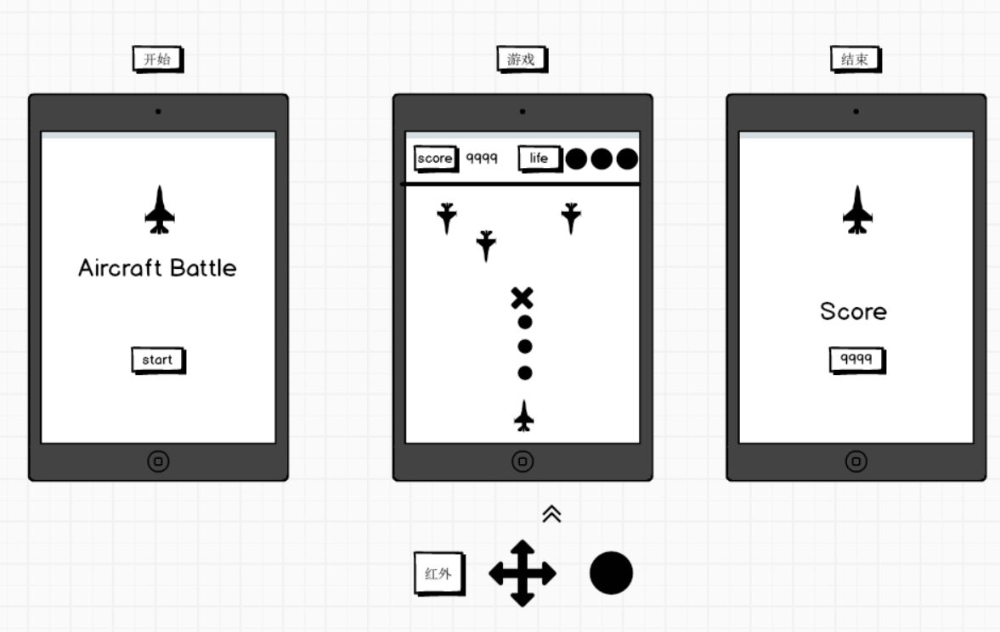
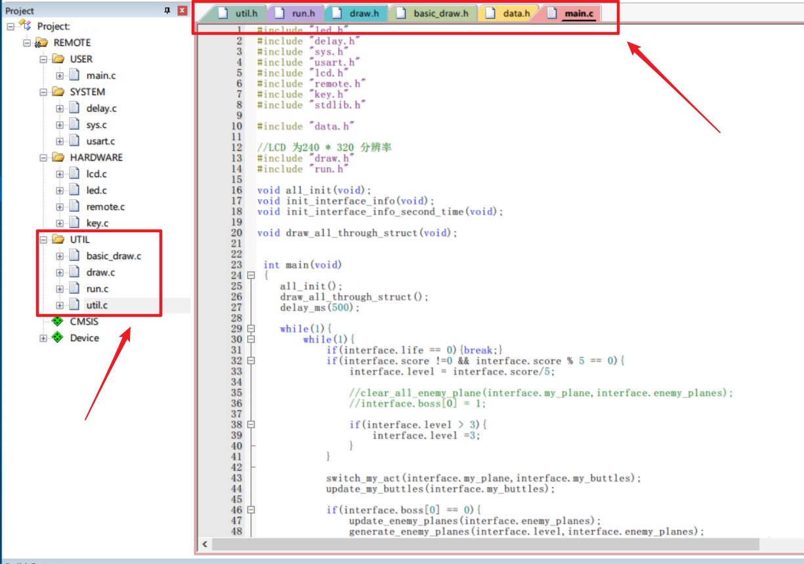

# 嵌入式-STM32 飞机大战
***

> 流程



```
1. 开始：初始化一个静态界面，只响应红外遥控上的 POWER 键 或者 KEY0，即开启游戏
2. 游戏：初始化界面，分上下两个部分， 上面分 分数 和 生命，
分数设计为 击落一个飞机 X 分（x为关卡数），生命代表飞机可以死几次。
此时只响应 红外遥控的 上下左右 和 play 按键，表示移动和发射子弹。
3. 死亡：当生命值为 0 时，结束游戏，显示结束画面。

0. 用随机数生成合适的敌方飞机下落中心位置。
1. 对方飞机只有向下动作，不发射子弹。
2. 子弹与敌方飞机像素重叠时，渲染消失。
3. 我方飞机和敌方飞机碰撞时，回到起始位置，同时生命减少一格，分数 +1。
4. 我方发射子弹为点状，最小相距间隔取合适值。
6. 关卡渐进：小飞机数量增多。
是否下一关可靠分数来判断如 5/10/15
```

> 动画原理
```
界面数据
全局维持 总结构体 包含
0. 最多三个玩家的分数/生命 
1. 我方飞机位置 x，y
2. 敌方所有普通飞机位置 x，y 数组，最大包含10个
3. 我方子弹数据 x，y 最多100 个，
4. 敌方子弹数据 x，y 最多300 个
5. 当前关卡等级

界面设计
1. 敌我飞机以 21*41 尺寸，子弹以3*3为尺寸，BOSS以41*81为尺寸，血量以 11*11 为尺寸，装饰用星 以 5*3 为尺寸
2. 贴图定位 以中心点为定位基点（方便直觉感觉 和 定位边界线）

边界条件
1. 上 41 下 319 左 1 右 239 

碰撞检测-盒模型
1. 我方飞机与敌方飞机碰撞
    + 相关量 
        - 分数 / 生命 / 我方飞机 / 敌方飞机
    + 相关逻辑
        - 碰撞条件：我方飞机 与 敌方飞机 中心点相距 小于等于 20 
    + 碰撞结果 
        - 我方飞机位置到初始位置/ 分数+1 / 生命-1 / 敌方飞机消失
    + 传参
        - 分数/生命指针 + 我方飞机位置数组 + 敌方所有飞机数组

2. 我方子弹与敌方飞机碰撞
    + 相关量
        - 分数 / 我方子弹 / 敌方飞机
    + 相关逻辑
        - 碰撞条件：我方子弹 与 敌方飞机 横差*2 + 竖差 小于等于 20 
    + 碰撞结果   
        - 我方子弹消失 / 分数+1 / 敌方飞机消失
    + 传参
        - 分数/生命指针 + 我方子弹位置数组 + 敌方所有飞机数组
```

> 代码结构

**图中所指为自我开发代码，底层调用 正点原子 库函数**


```c
基础功能：
data.h => 保存界面游戏数据，根据此数据渲染界面
basic_draw => 包含简单的画各种贴图的图形，如 米型图 / 敌我飞机图 / 子弹图 / 装饰性星型图等
basic => 整合 basic_draw， 提供封装好的几个主渲染函数， 如 开始界面渲染 / 游玩界面头部渲染 / 游玩界面游戏界面渲染 / 结束死亡界面
run => 帧动画模块，根据 main 函数扫描条件，执行数据更新，再调用 渲染 绘制界面
util => 工具模块，一些针对项目的 简单测试函数 / 简单操作函数 等

基本依赖:
标准库依赖 => CORE + Startup + Framework + GPIO + RCC + TIM + USART 
正点原子库 => SYSTEM(delay + sys + usart) + HARDWARE(lcd + led + remote + key)
个人开发 => main => data + run => draw => basic_draw + util
```

***
***
> 备注
```
```